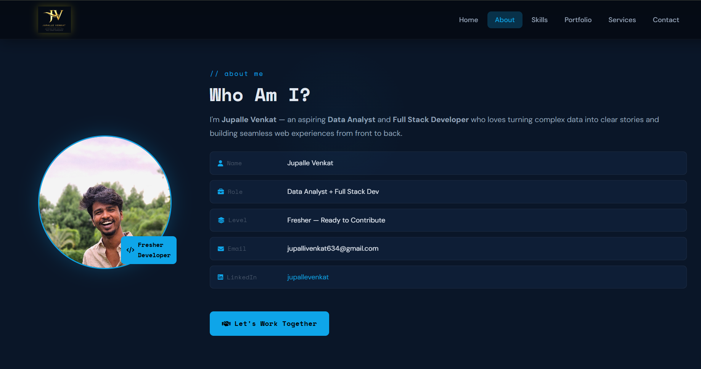

# 🌐 Jupalle Venkat — Personal Portfolio Website



[](https://venkyjupalli.github.io/my-portfolio/)
[](https://github.com/Venkyjupalli/my-portfolio)

A modern, responsive **full-stack portfolio website** showcasing my projects, technical skills, and experience. Built with **HTML, CSS, JavaScript** on the frontend and powered by a **Node.js + Express** backend with **MongoDB Atlas** for data storage and **Resend** for email notifications.

---

## 🔗 Live Demo

**🌍 Portfolio:**  
https://venkyjupalli.github.io/my-portfolio/

---

## 📋 Table of Contents

- About
- Features
- Project Structure
- Tech Stack
- Installation
- Environment Variables
- API Endpoints
- Contact Form Workflow
- Future Enhancements
- Contact

---

# 📌 About

This is my personal developer portfolio built to showcase my projects, technical skills, certifications, and resume.

The portfolio includes a fully functional backend that allows visitors to contact me through a live contact form. Every submission is securely stored in MongoDB Atlas, and I receive an email notification instantly using the Resend Email API.

---

# ✨ Features

## Frontend

- 🎨 Modern & Clean UI
- 📱 Fully Responsive Design
- 🍔 Responsive Mobile Navigation
- ✍️ Animated Typewriter Effect
- 🌟 Scroll Reveal Animations
- 🎯 Active Navigation Highlight
- 🧭 Sticky Navigation Bar
- 📄 Resume Download
- 📬 Contact Form Integration

---

## Backend

- 🚀 REST API built with Express.js
- 🗄️ MongoDB Atlas Integration
- 📩 Email Notifications using Resend
- 📬 Contact Form API
- 🌐 CORS Enabled
- 🔒 Environment Variable Configuration
- ⚡ Fast Cloud Deployment with Render

---

# 📁 Project Structure

```text
my-portfolio/

│
├── assets/
│   └── images/
│
├── server/
│   ├── config/
│   │   └── db.js
│   │
│   ├── controllers/
│   │   └── contactController.js
│   │
│   ├── models/
│   │   └── contact.js
│   │
│   ├── routes/
│   │   └── contactRoutes.js
│   │
│   ├── utils/
│   │   └── sendEmail.js
│   │
│   ├── app.js
│   ├── package.json
│   └── package-lock.json
│
├── index.html
├── style.css
├── script.js
├── package.json
├── package-lock.json
└── README.md
```

---

# 🛠️ Tech Stack

## Frontend

- HTML5
- CSS3
- JavaScript (ES6)
- Fetch API
- Intersection Observer API

---

## Backend

- Node.js
- Express.js
- MongoDB Atlas
- Mongoose
- Resend API
- Dotenv
- CORS

---

## Deployment

- GitHub Pages (Frontend)
- Render (Backend)
- MongoDB Atlas (Database)
- Resend (Email Service)

---

# 🚀 Installation

Clone the repository

```bash
git clone https://github.com/Venkyjupalli/my-portfolio.git
```

Navigate to the project

```bash
cd my-portfolio
```

Install frontend dependencies

```bash
npm install
```

Install backend dependencies

```bash
cd server
npm install
```

Start the backend server

```bash
npm start
```

Open `index.html` in your browser or use Live Server.

---

# 🔐 Environment Variables

Create a `.env` file inside the `server` folder.

```env
PORT=5000

MONGODB_URI=YOUR_MONGODB_CONNECTION_STRING

RESEND_API_KEY=YOUR_RESEND_API_KEY
```

> ⚠️ Never commit your `.env` file to GitHub.

---

# 🔌 API Endpoints

## Contact API

| Method | Endpoint | Description |
|---------|----------|-------------|
| POST | `/api/contact` | Submit contact message |
| GET | `/` | Backend health check |

---

## Contact Request

```json
{
  "name": "John Doe",
  "email": "john@example.com",
  "subject": "Hello",
  "message": "I'd like to connect with you."
}
```

---

## Success Response

```json
{
  "success": true,
  "message": "Message sent successfully"
}
```

---

## Error Response

```json
{
  "success": false,
  "message": "Server Error"
}
```

---

# 📬 Contact Form Workflow

```text
Visitor

      │

      ▼

Portfolio Website (GitHub Pages)

      │

      ▼

Render Backend API

      │

      ▼

MongoDB Atlas
(Store Contact Message)

      │

      ▼

Resend Email API

      │

      ▼

Email Notification to Me
```

---

# 🌟 Highlights

- ✅ Fully Responsive Portfolio
- ✅ Live Backend API
- ✅ MongoDB Cloud Database
- ✅ Email Notification System
- ✅ Production Deployment
- ✅ REST API Architecture

---

# 🔮 Future Enhancements

- 🌙 Dark / Light Theme
- 📊 Admin Dashboard
- 📈 GitHub Contribution Graph
- 📄 Blog Section
- 🤖 AI Chat Assistant
- 🌐 Custom Domain
- 📩 Automatic Reply Emails (after verifying a custom domain)

---

# 📞 Contact

## 👨‍💻 Jupalle Venkat

**Aspiring Software Engineer | Full Stack Developer | Data Analyst | AI Enthusiast**

📧 Email  
jupallivenkat634@gmail.com

🌐 Portfolio  
https://venkyjupalli.github.io/my-portfolio/

💻 GitHub  
https://github.com/Venkyjupalli

💼 LinkedIn  
https://www.linkedin.com/in/jupallevenkat/

---

# ⭐ Support

If you found this project useful, please consider giving it a ⭐ on GitHub.

It motivates me to build more open-source projects and continuously improve my work.

---

---

**Built with ❤️ by Jupalle Venkat**
